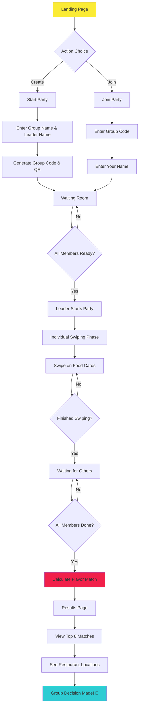

# Foodr 🍽️

**The Ultimate Group Food Decision Platform**

Foodr solves the age-old problem of group indecisiveness when choosing where to eat. Using a Tinder-like swiping mechanism, groups can collectively decide on food options through individual preferences, leading to a mutually agreeable "Flavor Match."

## 🎯 Purpose & Problem Statement

**The Problem:**
> "Hey what do y'all want to eat?" → "Anything" → "Chicken rice?" → "Anything" → "McDonald's?" → "Oh I ate that yesterday"

This frustrating cycle of indecision wastes time and tests patience, especially in group settings with friends, family, or colleagues.

**The Solution:**
Foodr transforms group food decision-making into an engaging, GRINDR LIKE SWIPING process where everyone's preferences matter. Through individual swiping and AI scoring algorithms, groups reach consensus efficiently + FUN.

## 🚀 Tech Stack

### Frontend
- **Next.js 15** - React framework with App Router
- **React 19** - Component library
- **TypeScript** - Type safety and developer experience
- **Tailwind CSS v4** - Utility-first styling
- **Shadcn/ui** - Component library built on Radix UI
- **Framer Motion** - Animation and gesture handling

### Backend & Database
- **Prisma ORM** - Type-safe database client
- **PostgreSQL** - Primary database (hosted on Supabase)
- **Supabase** - Backend-as-a-service platform
- **Upstash Redis** - Caching and session management

### APIs & Services
- **Google Generative AI** - Price estimation and content generation
- **Mapbox GL** - Interactive maps and location services
- **QR Code Generation** - Group joining functionality

### Development Tools
- **ESLint** - Code linting
- **PostCSS** - CSS processing
- **UUID/CUID2** - Unique identifier generation

## 🏗️ Technical Implementation

### Database Schema

```sql
-- Core entities
User: id, name, blobIcon
Group: id, code, name, leader_id_fk, hasStarted, hasCompleted
Food: id, name, image_path
Ratings: person_id_fk, food_id_fk, rating (SUPER_LIKE | LIKE | DISLIKE)
```

**Key Relationships:**
- Users can lead one group and be members of multiple groups
- Groups have unique join codes for easy access
- Food items can be rated by multiple users with different preference levels
- Ratings use enum values for consistent scoring

### Scoring Algorithm

The matching system uses a weighted scoring approach:


**Ranking Logic:**
1. **Primary Sort:** Weighted score (highest first)
2. **Secondary Sort:** Total engagement (most interactions first)
3. **Result:** Top 8 food items with highest group consensus

### Real-time Features Websocket
- **Live Group Status:** Members can see who has joined and completion status
- **Progress Tracking:** Real-time swiping progress updates
- **Instant Results:** Immediate flavor match calculation upon completion

## 📱 User Flow



### Detailed User Journey

1. **Group Creation/Joining**
   - Leaders create groups with custom names
   - Members join via 6-digit codes or QR scanning
   - Real-time member list updates

2. **Pre-Swiping Setup**
   - Waiting room shows all joined members
   - Leader has exclusive start authority
   - Avatar selection for personalization

3. **Swiping Phase**
   - Individual food card presentation
   - Three action types: Super Like (💖), Like (👍), Dislike (👎)
   - Progress tracking and seamless UX

4. **Results & Decision**
   - Algorithm calculates group preferences
   - Top 8 food matches displayed with scores
   - Restaurant location and pricing information
   - Group consensus achieved!

## 🏛️ Architecture Overview

### API Routes Structure
```
/api
├── groups/
│   ├── create/              # Group creation
│   ├── join/                # Group joining
│   └── [code]/
│       ├── route.ts         # Group details
│       ├── members/         # Member management
│       ├── start-party/     # Begin swiping
│       ├── results/         # Match results
│       └── has-started/     # Status check
├── food/                    # Food item CRUD
├── cuisine/                 # Cuisine categories
├── group-sessions/          # Swiping sessions
├── prices/                  # Price estimation
├── images/                  # Image handling
└── healthcheck/             # System status
```

### Component Hierarchy
```
App
├── Layout (Global styles, fonts)
├── Home Page
│   ├── GroupManager
│   ├── CreateGroupModal
│   └── JoinGroupModal
├── Holding Room ([code])
├── Swiping Interface
│   ├── Swiper Component
│   ├── IndividualSwipingPhase
│   └── FlavorMatchResults
└── Results Page
    ├── EnhancedResultsDisplay
    ├── DishCard
    └── RestaurantCount
```

### Data Flow Patterns
1. **State Management:** React hooks + localStorage for persistence
2. **API Communication:** RESTful endpoints with TypeScript interfaces
3. **Real-time Updates:** Polling-based status checking
4. **Caching Strategy:** Redis for session data, JSON files for restaurant info

## 🛠️ Setup & Development

### Prerequisites
- Node.js 18+ 
- PostgreSQL database
- Redis instance
- Mapbox API key
- Google AI API key

### Environment Variables
```bash
# Database
POSTGRES_URL="postgresql://..."
DIRECT_URL="postgresql://..."

# Redis
UPSTASH_REDIS_REST_URL="https://..."
UPSTASH_REDIS_REST_TOKEN="..."

# APIs
MAPBOX_ACCESS_TOKEN="pk...."
GOOGLE_AI_API_KEY="AI..."

# App
NEXT_PUBLIC_BASE_URL="http://localhost:3000"
```

### Installation & Setup

1. **Clone and Install**
   ```bash
   git clone <repository-url>
   cd foodr-smu-dot-hack
   npm install
   ```

2. **Database Setup**
   ```bash
   npx prisma generate
   npx prisma db push
   ```

3. **Development Server**
   ```bash
   npm run dev
   ```
   Open [http://localhost:3000](http://localhost:3000)

4. **Production Build**
   ```bash
   npm run build
   npm run start
   ```

### Available Scripts
- `npm run dev` - Start development server
- `npm run build` - Create production build
- `npm run lint` - Run ESLint
- `npm run create` - Create new Prisma migration
- `npm run apply` - Apply Prisma migrations

## 🚀 Deployment

The application is configured for deployment on Vercel with:
- Automatic PostgreSQL database migrations
- Environment variable management
- Edge runtime optimization
- Static asset optimization

### Deployment Checklist
- [ ] Environment variables configured
- [ ] Database migrations applied
- [ ] Redis instance connected
- [ ] API keys validated
- [ ] Domain DNS configured

## 🤝 Contributing

1. Fork the repository
2. Create a feature branch
3. Make your changes
4. Ensure tests pass and code is linted
5. Submit a pull request

---

**Built with ❤️ for solving real-world decision fatigue**